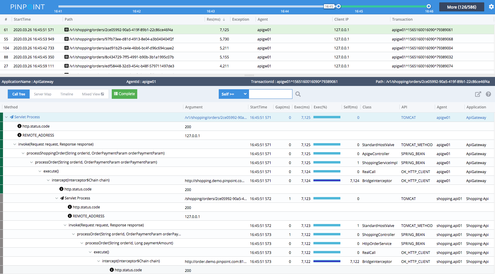

## Latest Release (2020/09/09)
We're happy to announce the release of Pinpoint v2.1.0. Please check the release note at (https://github.com/naver/pinpoint/releases/tag/v2.1.0).

The current stable version is v2.1.0.

## Live Demo
Take a quick look at Pinpoint with our demo!

## PHP, PYTHON
Pinpoint also supports application written in PHP, Python. Check-out our agent repository.

## About Pinpoint

**Pinpoint** is an APM (Application Performance Management) tool for large-scale distributed systems written in Java / PHP/PYTHON. Inspired by [Dapper](https://www.naver.com/), Pinpoint provides a solution to help analyze the overall structure of the system and how components within them are interconnected by tracing transactions across distributed applications.

You should definitely check **Pinpoint** out If you want to

* understand your [application topology](https://www.naver.com/) at a glance
* monitor your application in Real-Time
* gain code-level visibility to every transaction
* install APM Agents without changing a single line of code
* have minimal impact on the performance (approximately 3% increase in resource usage)

## Getting Started

* [Quick-start guide](https://www.naver.com/) for simple test run of Pinpoint
* [Installation guide](https://www.naver.com/) for further instructions.

## Overview

Services nowadays often consist of many different components, communicating amongst themselves as well as making API calls to external services. How each and every transaction gets executed is often left as a blackbox. Pinpoint traces transaction flows between these components and provides a clear view to identify problem areas and potential bottlenecks.
For a more intimate guide, please check out our [Introduction to Pinpoint video clip](https://www.naver.com/)

* **ServerMap** - Understand the topology of any distributed systems by visualizing how their components are interconnected. Clicking on a node reveals details about the component, such as its current status, and transaction count.

* **Realtime Active Thread Chart** - Monitor active threads inside applications in real-time.

* **Request/Response Scatter Chart** - Visualize request count and response patterns over time to identify potential problems. Transactions can be selected for additional detail by dragging over the chart.

